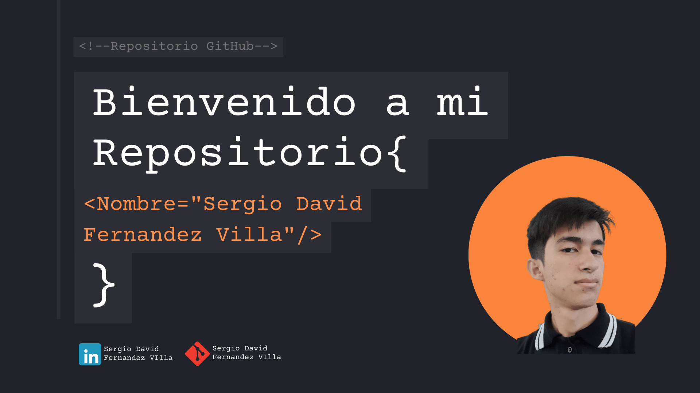

=======

## Soy un Desarrollador Web Frontend 💻

### Sobre mí

Soy un desarrollador apasionado con experiencia en React, Vite y Node.js como backend. También tengo habilidades en CSS y HTML puro, y estoy continuamente aprendiendo y mejorando mis habilidades en tecnologías frontend y backend.

### 🚀 Proyectos Actuales
- 🔭 Actualmente estoy trabajando en una aplicación web con React y Vite, utilizando Node.js para el backend.
- 🌱 Estoy aprendiendo sobre la instalación y configuración de OpenCV en sistemas Windows y explorando alternativas para el manejo de imágenes en Rust.

### 🤝 Colaboración
- 👯 Estoy buscando colaborar en proyectos de desarrollo web, especialmente aquellos que utilizan React, Node.js.

### 📬 Contacto
- 📫 Puedes contactarme a través de mi correo 📧: sergiodavidfernandezdev@gmail.com 
- 💬 Mi perfil en LinkedIn: https://www.linkedin.com/in/sergio-david-fern%C3%A1ndez-villa-6b86b328b

Gracias por visitar mi perfil. ¡Espero colaborar contigo pronto!

<!--
**SergioDavidFernandezVilla/SergioDavidFernandezVilla** is a ✨ _special_ ✨ repository because its `README.md` (this file) appears on your GitHub profile.

Here are some ideas to get you started:

- 🔭 I’m currently working on ...
- 🌱 I’m currently learning ...
- 👯 I’m looking to collaborate on ...
- 🤔 I’m looking for help with ...
- 💬 Ask me about ...
- 📫 How to reach me: ...
- 😄 Pronouns: ...
- ⚡ Fun fact: ...
-->
